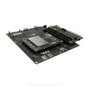

# Qualcomm® CM2290 Open Kits WIFI-MonoDepthEstimate-demo Developer documentation

## Introduce

This project relies on the CM2290 development kit to make use of the diverse and powerful connection capacity of the development kit. Enable AP WIFI through HostAPD and UDHCPD tools, and complete RTSP streaming media function through GStreamer, ZLMediaKit and FFMPEG. After connecting to WIFI, run this project, and move the on-board camera of CM2290 development board. The disparity video stream of monocular depth estimation can be viewed on the mobile phone.

The CM2290 development board can be used for the development of the sweeping robot, and the depth estimation is the technical basis for the autonomous navigation of the sweeping robot. That's what this project is all about.

The project was built in x86 host with across complier tool and has been tested in Qualcomm® CM2290 Open Kits.

Qualcomm® CM2290 SoC Open Kits



## Materials and Tools used for the project

1. Hardware materials

Except for the Open Kits,The following hardware materials are also needed:

* Type-C usb line

using the usb line to develop on Qualcomm® CM2290 SoC Open Kits.


* Charger

Direct power supply for Qualcomm® CM2290 SoC Open Kits.


## Environment configuration

This section mainly describes the source and configuration of some open source projects or third-party tools needed in the development process.

### Gstreamer
[Gstreamer](https://www.yoctoproject.org) <br>
GStreamer is a library for constructing graphs of media-handling components. The applications it supports range from simple Ogg/Vorbis playback, audio/video streaming to complex audio (mixing) and video (non-linear editing) processing.

### ZLMediaServer
ZLMediaServer is a high-performance operational level streaming media service framework based on C++11.

url: https://github.com/ZLMediaKit/ZLMediaKit

If you want to compile the project in source code, you can clone the entire project and modify zlmediakit_0.1.bb provided by the project to compile it using yocto.We also provide binary executables "MediaServer" generated by compilation in the bin directory.

### FFMPEG4
FFmpeg is a collection of libraries and tools to process multimedia content such as audio, video, subtitles and related metadata. url: https://www.ffmpeg.org/

In the same way, if you want to compile the project in source code, you can modify ffmpeg4_4.4.1.bb provided by the project to compile it using yocto.We also provide binary executables "ffmpeg4 & ffprobe4" generated by compilation in the bin directory.

### EasyPlayer APP
An free, elegant, simple, fast RTSP/RTMP/HLS/HTTP Player.EasyPlayer support RTSP(RTP over TCP/UDP)version& RTMP version & Pro version，cover all kinds of streaming media！

url: http://app.tsingsee.com/EasyRTSPlayer

## Compile

The compilation of the whole project is based on the yocto compilation tool, so you need to write some .bb and .conf files according to the specification. The gst-depth_0.1.bb file is provided in the project.

Please refer to [the official Manual of Yocto](https://www.yoctoproject.org) for how to add layers,write layer.conf. Then,excute the command as follows:

```
bitbake gst-depth
or
bitbake -b gst-depth_0.1.bb
```

You will get some executable bin file.Move to the bin folder of the project.

## Configure and Usage
Start the CM290 and connection CM290 to host by Type-c usb.
### 1. Configure
In the conf directory, a json configuration file is provided. This configuration file is relatively simple. It mainly configures the gstreamer camera pipeline, gstreamer udpsink push pipeline, and traditional depth estimation algorithm parameters.

### 2. Usage
The executable files in the bin directory do not require additional command line parameters. The parameters used by the program are configured by the json file, so you only need to put the configuration file in the same directory to execute the program.

```
./gst_depth_test
```